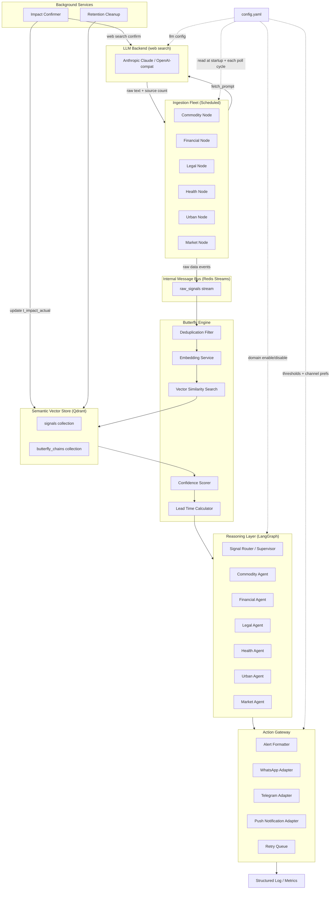
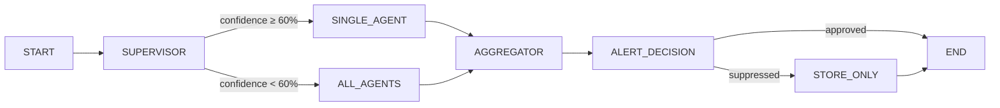

# Design Document: Butterfly Effect Signal Monitor

## Overview

The Butterfly Effect Signal Monitor is a single-operator agentic intelligence system that detects weak signals in public data before they manifest as real-world impacts. The system is built around the concept of **Temporal Arbitrage**: by calculating the Lead Time between a detected Signal and its predicted Impact, the operator gains an actionable window to act before the mass market reacts.

The system is a personal tool — there is no user database, no authentication layer, and no multi-tenancy. All operator preferences are stored in a local `config.yaml` file. The architecture is event-driven and microservice-oriented, running entirely on the operator's machine or a single private server.

### Key Design Principles

1. **Signal-first, not data-first**: Raw data is only valuable when it crosses a threshold that implies a future impact. The system filters aggressively.
2. **Lead Time is the product**: Every alert must carry a time window. Alerts without Lead Time are noise.
3. **Confidence before delivery**: No alert is dispatched without a Confidence Score ≥ 40, grounded in historical similarity.
4. **Local-first**: No cloud dependencies for core logic. The vector store, config, and agent state all run locally.
5. **Operator-controlled**: The config file is the single control surface. No UI, no database migrations.
6. **LLM as a data source**: Ingestion nodes do not scrape HTML directly — they issue structured prompts to an LLM with web search to gather and summarise public data. This removes the need for per-site scrapers and makes the ingestion layer resilient to page layout changes.

---

## Architecture

### High-Level Component Diagram



### Architecture Style: Event-Driven with LLM-Backed Ingestion

Each Ingestion Node runs as an independent APScheduler job. Rather than scraping HTML directly, every node issues a structured natural-language `fetch_prompt` to the configured LLM backend (Anthropic Claude with built-in web search, or any OpenAI-compatible provider). The LLM returns a plain-text summary of the relevant public data, which the node wraps into a `RawSignalEvent` and publishes to the `raw_signals` Redis Stream.

The Butterfly Engine consumes from this stream, performs deduplication, embedding, similarity search, and scoring, then routes validated signals to the Reasoning Layer. The Reasoning Layer's LangGraph supervisor dispatches to domain agents — each of which calls the LLM directly for domain-specific validation — and returns an enriched, scored signal to the Action Gateway for delivery.

Two background coroutines run indefinitely alongside the main pipeline: **ImpactConfirmer** (periodically verifies whether predicted impacts materialised, updating `t_impact_actual` in Qdrant) and **Retention Cleanup** (nightly Qdrant purge of records older than 3 years).

Redis is the message bus because it is lightweight, runs locally, and Redis Streams provide consumer groups, acknowledgement, and replay — sufficient for single-operator throughput without Kafka's operational overhead.

---

## Components and Interfaces

### 2.1 Ingestion Nodes

Each Ingestion Node is a Python module implementing `BaseIngestionNode`. Nodes are registered with `IngestionScheduler`, which wraps APScheduler and triggers a `LiveConfig.reload()` before each poll cycle so config changes take effect without restart. The scheduler enforces a **15-minute minimum poll interval** (`max(node.poll_interval_minutes, 15)`); nodes may set longer intervals.

```python
class BaseIngestionNode(ABC):
    node_id: str
    domain: Domain
    poll_interval_minutes: int  # floor of 15 min enforced by scheduler
    fetch_prompt: str           # natural-language prompt sent to LLM
    batch_eligible: bool = False  # True → Anthropic Batch API path (50% token discount)

    def __init__(self, redis: Redis, llm: LLMBackendConfig) -> None: ...

    # fetch() is NOT abstract — implemented in base using LLM web search
    async def fetch(self) -> list[RawDataRecord]: ...

    @abstractmethod
    async def parse(self, raw: RawDataRecord) -> list[RawSignalEvent]: ...

    async def run(self) -> None:
        """Routes to batch flow or real-time fetch→parse→publish. Handles retry + failure alert."""
```

**LLM Fetch Strategy**:

- If `llm.provider == "anthropic"` and `batch_eligible = True`: uses the **Anthropic Message Batches API** (see below).
- If `llm.provider == "anthropic"` and `batch_eligible = False`: calls `POST /v1/messages` with `web_search_20250305` tool enabled (when `web_search_enabled: true`). Text blocks are concatenated; `tool_result` block count becomes `source_count` in metadata.
- Otherwise: calls `POST /v1/chat/completions` (OpenAI-compat — Groq, Together, Ollama). No native web search; `source_count` is 0.

**Web search cap**: All Anthropic fetch calls (real-time and batch) pass `"max_uses": 1` on the `web_search_20250305` tool. This caps cost at one search fee ($0.01) per ingestion call and prevents multi-search blowouts on complex prompts. Each node's `fetch_prompt` is scoped to a single topic, so one search is sufficient to retrieve fresh data.

The `fetch()` result is a single `RawDataRecord` with `source_url="agent_web_search"` and `publication_date` set to the current UTC date.

**Anthropic Message Batches API** (`batch_eligible = True`):

Nodes whose signals have multi-day lead times (and therefore tolerate ~1 hour of async processing latency) use the Anthropic Message Batches API, which costs 50% of standard token prices. The flow per scheduler tick is:

1. Check Redis for a pending `batch_id` (`batch_pending:{node_id}`, 24h TTL).
2. If found: poll `GET /v1/messages/batches/{id}`.
   - If `processing_status != "ended"`: log and return — no new batch submitted this tick.
   - If ended: download JSONL results from `/v1/messages/batches/{id}/results`, extract text and `source_count`, publish `RawSignalEvent`s, delete the pending key.
3. Submit a new batch (`POST /v1/messages/batches`) and store its `id` in Redis.

On batch error or cancellation (`result.type != "succeeded"`): log a warning, delete the pending key, and submit a fresh batch — self-healing with no signal loss beyond one cycle.

**Poll intervals and batch eligibility by node**:

| Domain | Node | Interval | Mode | Rationale |
|---|---|---|---|---|
| Commodity | `mandi_node` | 60 min | Real-time | Agmarknet data updates once or twice daily; hourly polling is sufficient |
| Commodity | `imd_rainfall_node` | 360 min | Real-time | IMD district rainfall data updates every 6–12 hours; 6-hour cadence captures all new releases |

| Financial | `forex_node`, `brent_crude_node`, `gmp_node`, `gold_sentiment_node` | 240 min | Batch | Actionable moves on these instruments do not occur hourly; 4-hour cadence captures meaningful changes |
| Financial | `ipo_subscription_node` | 120 min | Real-time | Subscription data refreshes every 2–3 hours on NSE/BSE; 2-hour polling matches data freshness |
| Financial | `panchang_node` | 1440 min | Batch | Daily publication; once per day is sufficient |
| Legal | `gazette_node` | 1440 min | Batch | Gazettes are published once per working day; polling more frequently yields identical results |
| Legal | `state_portal_node` | 120 min | Batch | State portal notifications do not change hourly; 2-hour cadence captures daily batch releases |
| Legal | `slot_sentinel_node` | 30 min | Real-time | Passport/visa slots can fill quickly; 30-minute cadence is the minimum acceptable compromise for cost vs. responsiveness |
| Legal | `power_outage_node` | 60 min | Real-time | DISCOM outage notices are published in batches; hourly polling captures all new notices |
| Legal | `flight_status_node` | 60 min | Real-time | Only registered when `financial.monitored_flights` is non-empty |
| Health | `aqi_node` | 60 min | Real-time | CPCB AQI data updates hourly |
| Health | `imd_weather_node` | 120 min | Real-time | IMD forecasts update every 3–6 hours; 2-hour cadence captures all meaningful changes |
| Health | `social_sentiment_node` | 120 min | Real-time | Trending illness signals are slow-moving; 2-hour polling is responsive without excess cost |
| Market | `job_board_node` | 240 min | Real-time | Job market trends change over days, not hours; 4-hour cadence is more than sufficient |

**Retry Logic**: On any exception from `fetch()` or batch submission, the node records the failure time. After 60 consecutive minutes of failure, an `OPERATIONAL_ALERT` is logged at ERROR level.

**Deduplication**: Each `RawSignalEvent` carries a `content_hash` (SHA-256 of `source_url + publication_date + raw_content`). The Butterfly Engine checks this against a Redis SET (`seen_hashes`) with 7-day TTL before processing.

**TLS**: All outbound HTTP calls use a shared `tls_client()` (httpx `AsyncClient` with `verify=True`), enforcing TLS 1.2+.

**Supported Node Inventory**:

Node activation is controlled entirely by the `nodes:` section of `config.yaml`. Each node has an explicit `true`/`false` flag — there are no separate domain toggles or disabled lists. `main.py` reads `config.nodes` directly at startup and registers only the nodes set to `true`.

| Domain | Node | `nodes:` key |
|---|---|---|
| Commodity | `mandi_node` | `commodity_mandi` |
| Commodity | `imd_rainfall_node` | `commodity_imd_rainfall` |
| Commodity | `import_duty_node` | `commodity_import_duty` |
| Commodity | `mrp_monitor_node` | `commodity_mrp_monitor` |
| Financial | `forex_node` | `financial_forex` |
| Financial | `brent_crude_node` | `financial_brent_crude` |
| Financial | `gmp_node` | `financial_gmp` |
| Financial | `ipo_subscription_node` | `financial_ipo_subscription` |
| Financial | `gold_sentiment_node` | `financial_gold_sentiment` |
| Financial | `panchang_node` | `financial_panchang` |
| Legal | `gazette_node` | `legal_gazette` |
| Legal | `state_portal_node` | `legal_state_portal` |
| Legal | `slot_sentinel_node` | `legal_slot_sentinel` |
| Legal | `power_outage_node` | `legal_power_outage` |
| Legal | `flight_status_node` | `legal_flight_status` (also requires `financial.monitored_flights` non-empty) |
| Health | `aqi_node` | `health_aqi` |
| Health | `imd_weather_node` | `health_imd_weather` |
| Health | `social_sentiment_node` | `health_social_sentiment` |
| Urban | `social_geotagged_node` | `urban_social_geotagged` |
| Urban | `traffic_node` | `urban_traffic` |
| Market | `job_board_node` | `market_job_board` |
| Market | `municipal_gazette_node` | `market_municipal_gazette` |
| Market | `infrastructure_node` | `market_infrastructure` |
| Market | `business_directory_node` | `market_business_directory` |

The `parsers/` directory (`pdf_parser.py`, `html_parser.py`, `feed_parser.py`) exists for nodes that may need direct structured extraction in addition to or instead of the LLM fetch path.

### 2.2 Butterfly Engine

The Butterfly Engine is a stateless processing pipeline (`ButterflyEngineConsumer`) that consumes from the `raw_signals` Redis Stream via a consumer group and transforms a `RawSignalEvent` into a `ScoredSignal`. Each message is handled as an independent `asyncio.Task` with a 60-second pipeline timeout.

```python
@dataclass
class RawSignalEvent:
    event_id: str
    node_id: str
    domain: Domain
    content_hash: str
    source_url: str
    raw_text: str
    metadata: dict   # publication_date, issuing_authority, data_type, source_count, ...
    t_signal: datetime

@dataclass
class ScoredSignal:
    signal_id: str
    domain: Domain
    raw_text: str
    embedding: list[float]           # 768-dim
    t_signal: datetime
    t_impact_predicted: datetime
    lead_time_hours: float
    confidence_score: float          # 0–100
    top_similar_chains: list[ButterflyChain]
    metadata: dict
    suppressed: bool
    suppression_reason: str | None
```

**Processing Pipeline** (must complete within 60 seconds):

1. Deduplication check (Redis SET lookup on `content_hash`)
2. Text embedding via `sentence-transformers` (`asyncio.to_thread`)
3. Vector similarity search (Qdrant, top-5 cosine matches)
4. Lead Time calculation: `t_impact = t_signal + domain_lag_hours`; if `lead_time ≤ 0` → suppress and log
5. Confidence Score calculation (see algorithm below)
6. If `confidence < 40` → `suppressed = True`, store in vector store, do not forward
7. Route to Reasoning Layer via `asyncio.Queue`

### 2.3 Reasoning Layer (LangGraph)

The Reasoning Layer is a LangGraph `StateGraph` with a **Supervisor** node that routes signals to domain agents. Domain agents call the LLM directly (no LangGraph tool nodes) using `DomainAgent.validate()`.

```python
class ReasoningState(TypedDict):
    signal: ScoredSignal
    domain: str
    confidence_override: float | None
    agent_outputs: list[AgentOutput]
    final_confidence: float
    alert_approved: bool
    alert_payload: AlertPayload | None
```

**Supervisor routing logic**:

- Domain classification confidence ≥ 60%: route to single domain agent
- Domain classification confidence < 60%: fan out to all relevant agents, take highest confidence result

**Domain Agent interface**:

```python
class DomainAgent(ABC):
    domain: str

    def __init__(self, llm: LLMBackendConfig) -> None: ...

    @property
    @abstractmethod
    def validation_prompt(self) -> str:
        """Domain-specific instruction appended to the system prompt."""

    async def validate(self, state: ReasoningState) -> ReasoningState:
        """Calls LLM (Anthropic or OpenAI-compat), parses JSON AgentOutput."""
```

Each agent's system prompt instructs the LLM to return a JSON object with `alert_approved`, `confidence`, `summary` (≤160 chars), `impact_description`, and `recommended_action`. The agent parses this response into an `AgentOutput`; on parse failure it returns a zero-confidence suppressed output.

**Agent timeout**: If `validate()` does not complete within 30 seconds, the signal is pushed to the `fallback_queue` (an `asyncio.Queue` drained every 5 minutes) and retried.

### 2.4 Semantic Vector Store

Qdrant runs as a local embedded instance (no separate server process). Two collections:

- `signals`: every processed `ScoredSignal` — embedding + full metadata including `t_impact_actual` (nullable, updated by `ImpactConfirmer`)
- `butterfly_chains`: historical Signal→Impact pairs used for similarity search in the confidence algorithm

**`signals` collection payload schema**:

```json
{
  "vector_size": 768,
  "distance": "Cosine",
  "payload_schema": {
    "signal_id": "keyword",
    "domain": "keyword",
    "source_url": "keyword",
    "t_signal": "datetime",
    "t_impact_predicted": "datetime",
    "t_impact_actual": "datetime",
    "confidence_score": "float",
    "outcome_confirmed": "bool",
    "content_hash": "keyword"
  }
}
```

**Retention**: A nightly background coroutine calls `run_retention_cleanup()` which deletes records where `t_signal < now - 3 years AND outcome_confirmed = true`. Unconfirmed records are kept indefinitely.

### 2.5 Impact Confirmer

`ImpactConfirmer` is a background service (`run_forever()` coroutine) that periodically verifies whether previously predicted impacts have materialised.

```python
class ImpactConfirmer:
    def __init__(
        self,
        vector_store: VectorStore,
        llm: LLMBackendConfig,
        check_interval_hours: int,      # from config.system
        confirmation_window_hours: int,  # from config.system
    ) -> None: ...

    async def run_forever(self) -> None: ...
```

Every `check_interval_hours`, it fetches unconfirmed signals whose `t_impact_predicted` falls within the past `confirmation_window_hours`. For each, it issues a prompt to the LLM (with web search on Anthropic) asking whether the predicted impact has occurred. On confirmation, it calls `VectorStore.confirm_impact()` to set `t_impact_actual` and `outcome_confirmed = True`.

### 2.6 Action Gateway

The Action Gateway consumes approved `AlertPayload` objects from the Reasoning Layer and dispatches them.

```python
@dataclass
class AlertPayload:
    alert_id: str
    signal_id: str
    summary: str              # ≤ 160 characters
    impact_description: str
    lead_time_display: str    # e.g. "7–10 days"
    recommended_action: str
    confidence_score: float
    domain: str
    t_created: datetime

class ChannelAdapter(ABC):
    @abstractmethod
    async def send(self, payload: AlertPayload) -> DeliveryResult: ...
```

**Channel Adapters**:

- `TelegramAdapter`: `python-telegram-bot`
- `WhatsAppAdapter`: Twilio WhatsApp API
- `PushAdapter`: ntfy.sh (self-hosted or public) over plain HTTP

**Retry Logic**: On primary channel failure, retry on secondary channel within 10 minutes. Both channels are defined in `config.yaml`.

**Rate Limiting**: `RateLimiter` uses a Redis counter with 24-hour rolling window to enforce `alerts.daily_limit`.

**Quiet Hours**: Dispatcher checks `alerts.quiet_hours_start` / `quiet_hours_end` in the operator's configured timezone before sending.

---

## Configuration

`config.yaml` is the single control surface. `LiveConfig` wraps the config and reloads from disk on each APScheduler poll cycle (via `IngestionScheduler._run_node()`), so changes take effect without restart.

### Key Sections

```yaml
operator:
  city, state, pin_codes, income_bracket, occupation, family_size

alerts:
  primary_channel, secondary_channel
  min_confidence_threshold   # [40, 100]; currently 65 — signals below this are suppressed before dispatch
  daily_limit                # [1, 10]; currently 5
  quiet_hours_start, quiet_hours_end
  timezone

nodes:
  # Single control surface for all ingestion nodes — set true/false per node.
  # No other config section is needed to enable or disable a node.
  commodity_mandi, commodity_imd_rainfall, commodity_import_duty, commodity_mrp_monitor
  financial_forex, financial_brent_crude, financial_gmp, financial_ipo_subscription,
    financial_gold_sentiment, financial_panchang
  legal_gazette, legal_state_portal, legal_slot_sentinel, legal_power_outage,
    legal_flight_status
  health_aqi, health_imd_weather, health_social_sentiment
  urban_social_geotagged, urban_traffic
  market_job_board, market_municipal_gazette, market_infrastructure,
    market_business_directory

llm:
  provider        # anthropic | openai | groq | ollama
  model
  api_key_env
  base_url
  web_search_enabled

vector_store:
  path
  embedding_model  # paraphrase-multilingual-mpnet-base-v2

system:
  impact_check_interval_hours       # default 6; currently 24 — runs once daily
  impact_confirmation_window_hours  # default 24; currently 48

logging:
  level, log_file, metrics_file

channels:
  telegram / whatsapp / push  # env var references only, no raw secrets
```

Secrets (API keys, tokens) are read exclusively from environment variables referenced by name in the config. At startup, the platform verifies `.env` is in `.gitignore` and logs a WARNING if not.

---

## Data Models

### RawSignalEvent (Internal Message Bus)

```python
@dataclass
class RawSignalEvent:
    event_id: str        # UUID4
    node_id: str         # e.g. "financial_forex"
    domain: Domain       # Literal enum
    content_hash: str    # SHA-256 for deduplication
    source_url: str      # "agent_web_search" for LLM-fetched nodes
    raw_text: str
    metadata: dict       # publication_date, issuing_authority, data_type, source_count
    t_signal: datetime   # UTC
```

### ScoredSignal (Butterfly Engine Output)

```python
@dataclass
class ScoredSignal:
    signal_id: str
    domain: Domain
    raw_text: str
    embedding: list[float]           # 768-dim
    t_signal: datetime
    t_impact_predicted: datetime
    lead_time_hours: float           # must be > 0
    confidence_score: float          # 0–100
    top_similar_chains: list[ButterflyChain]
    metadata: dict
    suppressed: bool
    suppression_reason: str | None   # "duplicate" | "non_positive_lead_time" | "low_confidence"
```

### ButterflyChain (Vector Store Record)

```python
@dataclass
class ButterflyChain:
    chain_id: str
    signal_id: str
    domain: Domain
    source: str
    t_signal: datetime
    t_impact_predicted: datetime
    t_impact_actual: datetime | None    # set by ImpactConfirmer
    confidence_score: float
    embedding: list[float]
    outcome_confirmed: bool
    similarity_score: float | None      # populated during search
```

---

## Butterfly Engine — Algorithm Details

### Lead Time Calculation

```
Lead_Time_hours = (T_Impact_Predicted - T_Signal).total_seconds() / 3600

where T_Impact_Predicted = T_Signal + domain_lag_hours
```

Domain-specific lag estimates (seeded from historical chains, refined over time):

| Domain | Default Lag | Notes |
|---|---|---|
| Commodity (Mandi drop) | 7–10 days | Req 6.2 |
| Commodity (rainfall scarcity) | harvest-to-retail cycle | Req 7.4 |
| Financial (currency-tech) | 14–30 days | Req 10.2 |
| Financial (fuel) | 24 hours | Req 11.3 |
| Legal (slot sentinel) | immediate | Req 15.2 |
| Health (flu forecast) | 5 days | Req 16.2 |

If `Lead_Time ≤ 0`: discard signal, log with `signal_id` and `t_signal`, set `suppressed = True`.

### Confidence Score Algorithm

```
Base_Score = 50

Adjustments:
  + similarity_bonus:        top-5 cosine similarity avg > 0.7        → +15
  - low_history_penalty:     fewer than 3 matches with sim > 0.7      → -20
  + cross_validation_bonus:  source_count ≥ 2 independent sources     → +15
  + domain_specific_bonus:   domain-specific corroborating signal      → +15
  - recency_penalty:         most similar chain is > 2 years old       → -10

Final_Score = clamp(Base_Score + sum(adjustments), 0, 100)
```

`source_count` is populated by `_fetch_anthropic()` as the number of `tool_result` blocks returned by the web search tool. OpenAI-compat providers yield `source_count = 0`.

If `Final_Score < 40`: suppress alert, store signal in vector store for future improvement.

---

## Reasoning Layer — LangGraph Agent Graph

### Graph Structure



### Supervisor Node

Classifies the incoming `ScoredSignal` into a domain using keyword matching + embedding similarity against domain centroids. Routes to one agent (confidence ≥ 60%) or fans out to all agents (< 60%), taking the highest resulting confidence.

### Aggregator Node

Merges all `AgentOutput` records in `state["agent_outputs"]`. Sets `final_confidence` to the maximum agent confidence. Approves the alert if `final_confidence ≥ config.alerts.min_confidence_threshold` and `lead_time > 0`.

### Alert Decision Node

Constructs the `AlertPayload` from the best `AgentOutput`. Passes to the Action Gateway if approved; stores only in vector store if suppressed.

---

## Secrets Management

```
TELEGRAM_BOT_TOKEN=...
TELEGRAM_CHAT_ID=...
TWILIO_ACCOUNT_SID=...
TWILIO_AUTH_TOKEN=...
TWILIO_WHATSAPP_FROM=whatsapp:+14155238886
OPERATOR_WHATSAPP_NUMBER=whatsapp:+91XXXXXXXXXX
NTFY_TOPIC=besm-operator-alerts
ANTHROPIC_API_KEY=...
```

The `config.yaml` references these by env var name (e.g., `bot_token_env: TELEGRAM_BOT_TOKEN`). No raw credential ever appears in config or source code. `load_secrets()` in `main.py` loads `.env` via `python-dotenv` before any component initialises.

---

## Error Handling

| Scenario | Handling |
|---|---|
| Ingestion Node LLM/HTTP error | Record failure time; retry on next APScheduler tick; after 60 min → `OPERATIONAL_ALERT` logged at ERROR |
| Duplicate signal (`content_hash` seen) | `suppressed = True`, `suppression_reason = "duplicate"`, silent drop after ack |
| Lead Time ≤ 0 | `suppressed = True`, log with `signal_id` + `t_signal` |
| Confidence Score < 40 | `suppressed = True`, store in vector store, do not forward |
| Domain agent timeout (30s) | Log failure; push to `fallback_queue`; retry in 5 min |
| Pipeline timeout (60s) | Log `pipeline_timeout`; ack message to avoid redelivery |
| Primary channel delivery failure | Retry on secondary channel within 10 min |
| Secondary channel delivery failure | Log final failure; no further retry |
| Config file missing or invalid | `load_config()` raises; `main()` exits with non-zero code |
| Secrets file not in `.gitignore` | Log WARNING at startup; continue |
| Vector store similarity search > 2s | Log latency warning; continue with reduced confidence |
| Daily alert limit reached | Suppress remaining alerts; log suppression count |
| Impact confirmation LLM error | Log WARNING; skip this record; retry on next interval |

---

## Observability

**Structured Logging** (`structlog`, JSON output to `logs/besm.log`): all pipeline events are logged with structured fields — `signal_id`, `domain`, `confidence`, `lead_time_hours`, `suppressed`, `channel`, `latency_s`.

**Metrics** (`MetricsCollector`, JSONL output to `logs/metrics.jsonl`): records `signal_processed` and `alert_delivered` events with latency and success fields.

**Delivery Monitor** (`DeliveryMonitor`): maintains an in-memory rolling deque per channel. On every `record()` call it evicts events older than 1 hour and checks success rate. If rate < 0.90, logs `OPERATIONAL_ALERT` at ERROR level.

**Startup Checks** (`run_startup_checks()`): verifies config file exists, Redis is reachable, and `.env` is in `.gitignore` before any component starts.

---

## Technology Stack

| Component | Technology | Rationale |
|---|---|---|
| Language | Python 3.11+ | Ecosystem fit: LangGraph, sentence-transformers, pdfplumber all have first-class Python support |
| Ingestion data source | LLM web search (Anthropic / OpenAI-compat) | Eliminates per-site scraper maintenance; handles JS-rendered pages; multilingual output |
| Direct parsing fallback | Playwright + BeautifulSoup, pdfplumber, feedparser | Available for nodes that need structured extraction beyond LLM summarisation |
| Task Scheduling | APScheduler 3.x (AsyncIOScheduler) | No broker required; in-process; supports hot-reload via `LiveConfig` |
| Message Bus | Redis Streams | Lightweight, local, consumer groups + ack; sufficient for single-operator volume |
| Embedding Model | `paraphrase-multilingual-mpnet-base-v2` | 768-dim; 50+ languages including Hindi/regional Indian; runs locally |
| Vector Store | Qdrant (embedded mode) | Rust-based; embedded mode = no separate server; cosine similarity native; 3-year retention feasible |
| Reasoning Layer | LangGraph (StateGraph) | Native supervisor + multi-agent patterns; stateful graph with checkpointing |
| LLM Backend | Anthropic Claude Haiku 4.5 (default) / OpenAI-compat | Used for both ingestion fetch and agent validation; swappable via config. Batch-eligible nodes use the Anthropic Message Batches API (50% token discount). |
| Action Gateway — Telegram | python-telegram-bot | Official async library |
| Action Gateway — WhatsApp | Twilio WhatsApp API | Reliable programmatic WhatsApp access |
| Action Gateway — Push | ntfy.sh | Open-source, self-hostable; HTTP-based; no app required |
| Config Validation | Pydantic v2 | Schema validation with descriptive errors; `LiveConfig` for hot-reload |
| Secrets Management | python-dotenv | Loads `.env`; startup gitignore check |
| TLS | httpx `AsyncClient` (verify=True) | All outbound calls enforce TLS 1.2+ |
| Structured Logging | structlog | JSON-structured output; JSONL metrics file |
| Testing — Unit/Integration | pytest + pytest-asyncio | Standard; async support |
| Testing — Property-Based | Hypothesis | Mature PBT; integrates with pytest |


---


## Correctness Properties

### Property 1: Lead Time Calculation and Non-Positive Discard

For any signal, `Lead_Time = T_Impact_Predicted - T_Signal`. If `T_Impact_Predicted ≤ T_Signal`, the engine must set `suppressed = True` and log the discard. If `T_Impact_Predicted > T_Signal`, it must not suppress on lead time alone.

---

### Property 2: Confidence Score Invariant

For any combination of inputs, `confidence_score ∈ [0, 100]`. For any signal with `confidence_score < 40`, `suppressed = True` and the signal is queued for vector store storage rather than forwarded to the Action Gateway.

---

### Property 3: Low Historical Precedent Penalty

For any signal where fewer than 3 historical chains have cosine similarity > 0.7, the score must be 20 points lower than it would be with 3 or more qualifying matches, regardless of domain or other adjustments.

---

### Property 4: Deduplication Idempotence

For any `content_hash`, submitting the identical event a second time must result in a silent drop. System state after two identical submissions must equal state after one.

---

### Property 5: Ingestion Node Retry on Failure

For any exception (HTTP error, network failure) from `fetch()`, the node must log the failure with `node_id` and error, and the next APScheduler tick (≤ 5 minutes) must retry. This must hold for all error types.

---

### Property 6: Operational Alert After Sustained Ingestion Failure

For any node, if `consecutive_failure_duration > 3600s`, an `OPERATIONAL_ALERT` must be logged. At exactly 3600s, no alert. At 3601s, an alert must be raised.

---

### Property 7: PDF Extraction Completeness

For any government PDF with a `publication_date` and `issuing_authority`, the parser must produce a `RawSignalEvent` with non-empty `raw_text`, valid `publication_date`, and non-empty `issuing_authority` in metadata.

---

### Property 8: Vector Store Round-Trip Fidelity

For any `ScoredSignal` stored in Qdrant, retrieving by `signal_id` must return a record where `source`, `domain`, `t_signal`, `t_impact_predicted`, and `confidence_score` exactly equal the stored values. `t_impact_actual` must be present (possibly null) and unaltered by storage.

---

### Property 9: Similarity Search Ordering

For any query embedding, returned results must be ordered descending by cosine similarity: for any `r_i`, `r_j` where `i < j`, `cosine_similarity(query, r_i) ≥ cosine_similarity(query, r_j)`.

---

### Property 10: Domain Routing Correctness

For any signal with domain classification confidence ≥ 60%, the supervisor must invoke exactly one agent. For confidence < 60%, it must invoke all relevant agents and `final_confidence = max(agent_outputs.confidence)`. These two behaviors must be mutually exclusive and exhaustive.

---

### Property 11: Alert Dispatch Gating

For any `AlertPayload`, the gateway must dispatch if and only if `confidence_score ≥ min_confidence_threshold` AND `lead_time > 0`. Any alert failing either condition must be suppressed, consistently across all domains and channels.

---

### Property 12: Alert Format Completeness

For any `AlertPayload`, the formatter must produce output containing: (a) summary ≤ 160 chars, (b) non-empty impact description, (c) lead time window in days or hours, (d) exactly one recommended action.

---

### Property 13: Secondary Channel Failover

For any primary channel failure, the gateway must enqueue the alert for retry on a different secondary channel. This must trigger for all failure modes: network error, API error, timeout.

**Validates: Requirements 5.5**

---

### Property 14: Daily Alert Limit Enforcement

For any sequence of N approved alerts in a 24-hour rolling window where N > `daily_limit`, exactly `daily_limit` alerts must be dispatched and the remainder suppressed. Total dispatched in any 24-hour window must never exceed `daily_limit`.

---

### Property 15: Config Validation Rejects Invalid Values

For any config with `min_confidence_threshold` outside [40, 100], `daily_limit` outside [1, 10], missing required fields, or unrecognised channel names, `load_config()` must raise a descriptive `ValueError` identifying the invalid field. No invalid config may pass validation silently.

---

### Property 16: Agent Timeout Triggers Fallback

For any domain agent that does not respond within 30 seconds, the Reasoning Layer must (a) log the failure with `signal_id`, agent name, and timestamp, and (b) push the signal to the fallback queue. The signal must not be lost.

---

### Property 17: Delivery Success Rate Monitoring

For any sequence of delivery attempts on a channel within a rolling 1-hour window: if success rate < 0.90, an `OPERATIONAL_ALERT` must be raised. At exactly 0.90, no alert. Below 0.90, an alert must be raised.
